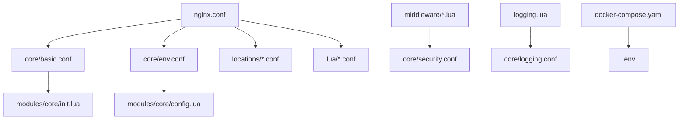

# Project Structure Documentation

## Overview
This document outlines the structure and purpose of each component in the Hadish API Gateway project. The architecture is designed to be modular and extensible, allowing for incremental feature implementation and easy maintenance.

## Root Directory
```
./
├── configs/           # OpenResty/Nginx configuration files
├── modules/           # Lua modules for core functionality and middleware
│   ├── core/         # Core operations (config, init, error handling)
│   ├── middleware/   # Request/response manipulation, security, logging
│   ├── services/     # Service-specific logic handlers
│   └── utils/        # Common utilities (env, validation, formatting)
├── docs/             # Project documentation
├── tests/            # Test suites
│   ├── integration/  # End-to-end tests
│   ├── smoke/        # Basic functionality tests
│   └── unit/        # Individual module tests
└── logs/             # Log files
    ├── access.log    # Request/response logs
    ├── error.log     # Error events
    └── security.log  # Security-related events
```

## Configuration Files (`configs/`)

### Core Configurations (`configs/core/`)
- `basic.conf`: Core worker and event settings
  - Worker processes configuration
  - Event loop settings
  - Basic server parameters

- `env.conf`: Environment variable declarations
  - Defines which environment variables are accessible
  - Supports dynamic configuration through environment variables

- `security.conf`: Security-related configurations
  - Will integrate with security middleware modules
  - Configures CORS, rate limiting, and IP banning policies

- `logging.conf`: Logging configurations
  - Will define logging formats and destinations
  - Integrates with logging middleware

- `ratelimit.conf`: Rate limiting settings
  - Will configure thresholds and policies
  - Works in conjunction with rate limiting middleware

- `ipban.conf`: IP banning configurations
  - Defines ban thresholds and durations
  - Configures whitelists and blacklists
  - Specifies ban triggers and conditions

- `time_maps.conf`: Time-based configurations
  - Defines time windows for rate limiting
  - Sets cache expiration periods
  - Configures scheduled operations

- `mime.conf`: MIME type mappings
  - Defines supported content types
  - Maps file extensions to MIME types
  - Configures content type headers

### Location Configurations (`configs/locations/`)
- `default.conf`: Default location handler
  - Handles root path (/)
  - Returns API gateway status

- `health.conf`: Health check endpoint
  - Handles /health path
  - Returns service health status

- `admin.conf`: Admin API endpoints
  - Will handle administrative operations
  - Planned integration with admin service

- `debug.conf`: Debug endpoints
  - Will provide debugging capabilities
  - Planned integration with monitoring

- `errors.conf`: Error handling
  - Will define custom error responses
  - Integrates with error handling module

### Lua Configurations (`configs/lua/`)
Critical components for OpenResty Lua integration:
- `init.conf`: Lua initialization
  - Initializes global variables
  - Sets up required libraries
  - Configures startup behavior

- `dict.conf`: Shared dictionary definitions
  - Defines memory spaces for:
    - Rate limiting counters
    - Caching
    - Session storage
    - Temporary data storage

- `paths.conf`: Lua path configurations
  - Sets up module search paths
  - Enables modular code organization
  - Facilitates plugin system

### Main Configuration
- `nginx.conf`: Main OpenResty configuration file
  - Orchestrates all configuration includes
  - Defines server architecture
  - Enables feature modules

## Lua Modules (`modules/`)

### Example Module Structure
- `example_module_structure.lua`: Template file demonstrating:
  - Standard module organization
  - Required function implementations
  - Documentation format
  - Error handling patterns
  Note: This is a reference file, not used in production.

### Core (`modules/core/`)
- `init.lua`: Core initialization
  - Bootstraps the application
  - Loads required libraries
  - Initializes shared states

- `config.lua`: Configuration management
  - Loads and validates environment variables
  - Provides centralized configuration access
  - Manages configuration updates

- `error_handler.lua`: Centralized error handling
  - Standardizes error responses
  - Preserves original service error responses
  - Handles internal gateway errors
  - Examples:
    - 502: Service unavailable (cannot connect to backend)
    - 504: Gateway timeout
    - 500: Internal gateway errors

- `middleware_chain.lua`: Middleware orchestration
  - Manages request/response lifecycle
  - Sequential middleware execution:
    1. Pre-request processing (logging, rate limiting)
    2. Request transformation (if needed)
    3. Proxy to backend service
    4. Response handling
    5. Post-response processing (metrics, logging)
  - Supports conditional middleware execution
  - Allows dynamic middleware configuration

### Middleware (`modules/middleware/`)
Organized into functional categories:

#### Security (`middleware/security/`)
- `ratelimit.lua`: Request rate limiting
- `ipban.lua`: IP blocking system
- `cors.lua`: CORS handling

#### Logging (`middleware/logging/`)
- `logging.lua`: Request/response logging
- `formatter.lua`: Log format handlers
- `output.lua`: Log output managers

#### Metrics (`middleware/metrics/`)
- `metrics.lua`: Performance monitoring
- `collector.lua`: Data collection
- `reporter.lua`: Metrics reporting

### Services (`modules/services/`)
Service-specific logic and handlers:
- `admin.lua`: Administrative operations
  - Backend service management
  - Configuration updates
  - System monitoring

- `health.lua`: Health check management
  - Service health monitoring
  - Status reporting
  - Health metrics collection

### Utils (`modules/utils/`)
- Environment management
- Data validation
- Common operations

## Environment Files
- `.env`: Active environment variables
  ```
  # Current Configuration
  API_GATEWAY_PORT=8080          # Port where the gateway listens
  APP_WORKER_PROCESSES=auto      # Number of worker processes (auto = CPU cores)
  APP_WORKER_CONNECTIONS=1024    # Connections per worker
  LOG_LEVEL=notice              # Logging verbosity

  # Planned Configurations
  # Security Settings
  # RATE_LIMIT_REQUESTS=100     # Maximum requests per time window
  # RATE_LIMIT_WINDOW=60        # Time window in seconds for rate limiting
  # RATE_LIMIT_BURST=120        # Allowed request burst
  # IP_BAN_MAX_FAILS=10         # Failed requests before IP ban
  # IP_BAN_DURATION=3600        # Ban duration in seconds

  # CORS Settings
  # CORS_ALLOWED_ORIGINS=*      # Comma-separated list of allowed origins
  # CORS_ALLOWED_METHODS=GET,POST,PUT,DELETE  # Allowed HTTP methods
  # CORS_ALLOWED_HEADERS=Content-Type,Authorization  # Allowed headers
  # CORS_EXPOSE_HEADERS=       # Headers exposed to browsers
  # CORS_MAX_AGE=3600         # Preflight cache duration

  # Logging Configuration
  # LOG_FORMAT=json           # Log format (json/text)
  # LOG_OUTPUT=file          # Log output destination
  # LOG_ROTATION_SIZE=100M   # Size before log rotation
  # LOG_RETENTION_DAYS=30    # Days to keep rotated logs
  ```

## Implementation Roadmap

### Phase 1: Core Infrastructure
- [x] Basic server setup
- [x] Configuration loading
- [ ] Error handling
- [ ] Middleware chain

### Phase 2: Essential Features
- [ ] Logging system
- [ ] Basic security
- [ ] Health monitoring

### Phase 3: Advanced Features
- [ ] Rate limiting
- [ ] IP banning
- [ ] Advanced monitoring

## File Dependencies


## Extensibility
The modular architecture supports:
- Adding new endpoints in `configs/locations/`
- Implementing new middleware in `modules/middleware/`
- Extending core functionality through `modules/core/`
- Adding utility functions in `modules/utils/`

## Notes
- Each module and configuration file is designed for specific functionality
- Features will be implemented incrementally following the roadmap
- All components are designed to work together through the middleware chain
- Configuration can be dynamically adjusted through environment variables

## Log Files (`logs/`)
Structured logging for different aspects of the gateway:

### Access Logs (`access.log`)
- Records all incoming requests
- Captures response status and timing
- Tracks client information
- Format: JSON or customizable format

### Error Logs (`error.log`)
- Captures system errors
- Records configuration issues
- Logs initialization problems
- Includes stack traces when available

### Security Logs (`security.log`)
- Records security events
- Tracks IP bans and rate limit violations
- Logs CORS violations
- Documents authentication failures

## Test Suite (`tests/`)

### Integration Tests (`tests/integration/`)
- End-to-end request flow testing
- Service integration verification
- Middleware chain validation
- Performance testing scenarios

### Smoke Tests (`tests/smoke/`)
- Critical path testing
- Basic functionality verification
- Deployment readiness checks
- Quick health validation

### Unit Tests (`tests/unit/`)
- Individual module testing
- Utility function verification
- Error handling validation
- Mock-based testing